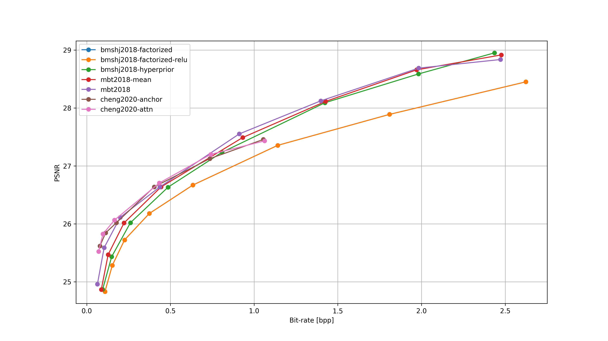
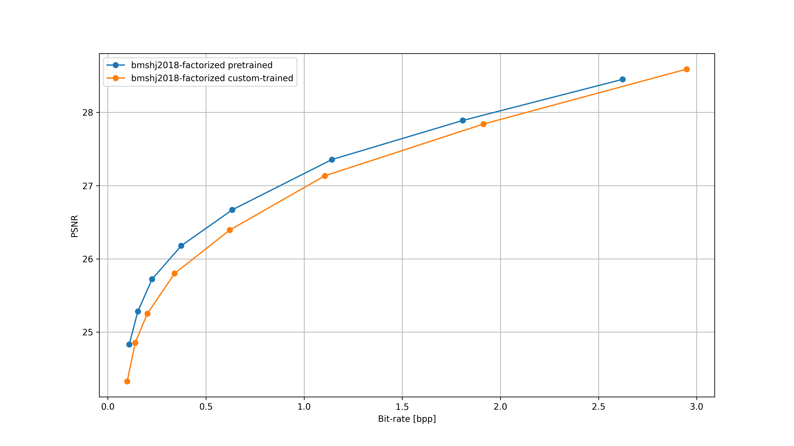

# CompressAI-metrics
An introductory investigation into image metrics and AI model training, conducted with the models provided by the [CompressAI](https://github.com/InterDigitalInc/CompressAI) library.

## Getting Started
These instructions will help you set up and run a local copy of the project.

### Metrics
For both scripts, we will use the following [PIQ](https://github.com/photosynthesis-team/piq/tree/master)'s Full-Reference Image Metrics: 

| Acronym   | Year | Metric                                                  |
| --------- | ---- | ------------------------------------------------------- |
| PSNR      | -    | [Peak Signal-to-Noise Ratio](https://en.wikipedia.org/wiki/Peak_signal-to-noise_ratio) |
| SSIM      | 2003 | [Structural Similarity](https://en.wikipedia.org/wiki/Structural_similarity) |
| MS-SSIM   | 2004 | [Multi-Scale Structural Similarity](https://ieeexplore.ieee.org/abstract/document/1292216) |
| IW-SSIM   | 2011 | [Information Content Weighted Structural Similarity Index](https://ece.uwaterloo.ca/~z70wang/publications/IWSSIM.pdf) |
| VIFp     | 2004 | [Visual Information Fidelity](https://ieeexplore.ieee.org/document/1576816) |
| FSIM     | 2011 | [Feature Similarity Index Measure](https://ieeexplore.ieee.org/document/5705575) |
| SR-SIM   | 2012 | [Spectral Residual Based Similarity](https://sse.tongji.edu.cn/linzhang/ICIP12/ICIP-SR-SIM.pdf) |
| GMSD     | 2013 | [Gradient Magnitude Similarity Deviation](https://arxiv.org/abs/1308.3052) |
| MS-GMSD  | 2017 | [Multi-Scale Gradient Magnitude Similarity Deviation](https://ieeexplore.ieee.org/document/7952357) |
| VSI      | 2014 | [Visual Saliency-induced Index](https://ieeexplore.ieee.org/document/6873260) |
| DSS      | 2015 | [DCT Subband Similarity Index](https://ieeexplore.ieee.org/document/7351172) |
| HaarPSI  | 2016 | [Haar Perceptual Similarity Index](https://arxiv.org/abs/1607.06140) |
| MDSI     | 2016 | [Mean Deviation Similarity Index](https://arxiv.org/abs/1608.07433) |

### Script Descriptions
- **1_compare_pretrained.py**: This script compares the original and decoded images using the specified image metrics across all quality levels and available pretrained models in the CompressAI repository.

- **2_train_and_compare.py**: In this script, one or more models are trained using a provided dataset, and then compared to their corresponding pretrained models. The comparison involves the same image metrics as in the previous section, applied between the original and decoded images.

## Prerequisites
- Python 3
- pip
- An image dataset

## Installing

```bash
# Clone and cd into the repository
git clone https://github.com/akaTsunemori/CompressAI-metrics.git
cd CompressAI-metrics

# Install the pre-requirements
pip install -r requirements.txt
```

The dataset should be moved to a folder named **dataset**, and must be in the same format as specified in the [compressai.datasets](https://interdigitalinc.github.io/CompressAI/datasets.html) page.

## Usage
The image to be used in all comparisons should be in the [static](static) folder and it needs to be named **original.png**. Each script can be run independently, and their results will be saved in the **results** folder. While the results from each script do not overlap, the decoded images are temporarily stored in a folder named **img** during the process and do overlap each other. Once a script finishes running, it will generate an image for each metric used, displaying a plot that shows the relationship between the metric and the bit-rate (bpp) from the encoded image.

## Results
The results from this study are stored in the [1_results_pretrained](results/1_results_pretrained) and [2_results_custom_trained](results/2_results_custom_trained) folders.

### Target image
The image utilized in both scripts is stored in the **static** folder. This image was intentionally selected for its significant background noise and the fact that it's a digital illustration.


### Compare pretrained


### Train and compare
The study trained the **bmshj2018-factorized** model on the JPEGAI dataset with the parameters:
- Epochs: 20
- Learning rate: 1e-4
- Aux learning rate: 1e-3
- Batch size: 16
- Test batch size: 64
- Patch size: 256x256
- Clipping max norm: 1.0

The following loss and lambda values were used for training:
| Quality | 1 | 2 | 3 | 4 | 5 | 6 | 7 | 8 |
| ------- | - | - | - | - | - | - | - | - |
| MSE | 0.0018 | 0.0035 | 0.0067 | 0.0130 | 0.0250 | 0.0483 | 0.0932 | 0.1800 |



## Acknowledgments
- [CompressAI](https://github.com/InterDigitalInc/CompressAI), a PyTorch library and evaluation platform for end-to-end compression research.
- The files [utils/codec.py](utils/codec.py) and [utils/train.py](utils/train.py) are modified versions from CompressAI's [codec.py](https://github.com/InterDigitalInc/CompressAI/blob/master/examples/codec.py) and [train.py](https://github.com/InterDigitalInc/CompressAI/blob/master/examples/train.py).
- [PIQ](https://github.com/photosynthesis-team/piq), a collection of measures and metrics for image quality assessment.

## License
GNU GENERAL PUBLIC LICENSE<br>
Version 2, June 1991

---

> GitHub [@akaTsunemori](https://github.com/akaTsunemori)
